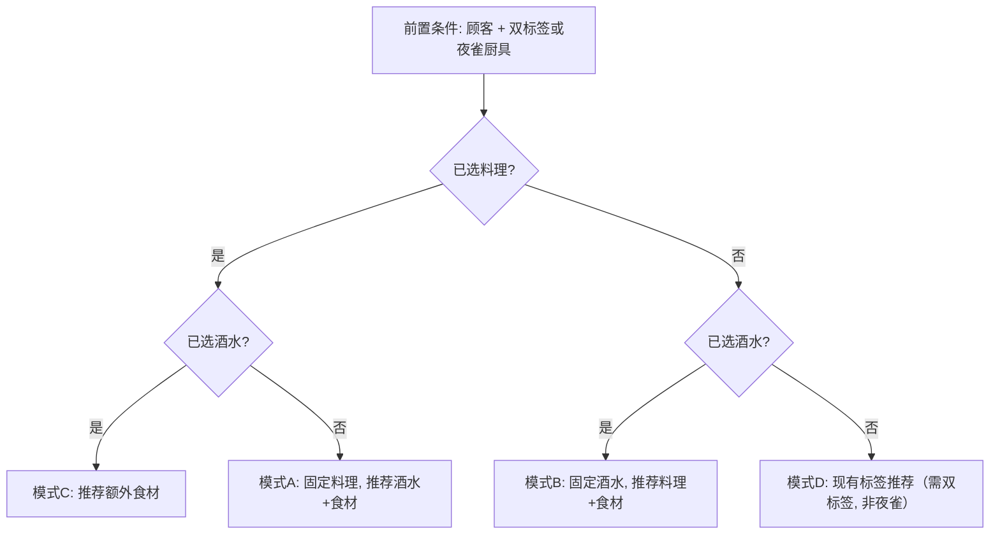

# 动态推荐扩展

## 需求概要

当前"猜您想要"模块仅在用户选中双点单标签时激活，推荐完整的（料理+酒水+额外食材）套餐。现需扩展为：在**已选双点单标签的前提下**，如果用户还选择了料理和/或酒水，则基于已选项动态推荐互补项来组成高分套餐，而非固定使用标签全量搜索。

## 前置条件

所有推荐模式均需满足：

- 已选中稀客
- **已选中双点单标签（recipeTag + beverageTag）**，或已启用夜雀厨具（夜雀厨具下点单标签不需要）

注意：夜雀厨具仅在用户已选料理或酒水后才可切换（参考 [`resultCard.tsx`](<app/(pages)/customer-rare/resultCard.tsx>)），因此夜雀厨具场景天然属于模式 A/B/C，不影响模式 D。

## 推荐模式与触发条件

在前置条件满足的基础上，根据用户的料理/酒水选择状态自动切换：



| 模式 | 已选项      | 推荐内容               | 夜雀厨具                                |
| ---- | ----------- | ---------------------- | --------------------------------------- |
| A    | 料理        | 酒水 + 额外食材        | 支持（传入 `hasMystiaCooker` 参与评分） |
| B    | 酒水        | 料理 + 额外食材        | 支持（同上）                            |
| C    | 料理 + 酒水 | 额外食材               | 支持（同上）                            |
| D    | 无          | 料理 + 酒水 + 额外食材 | 不适用（模式 D 要求双标签且非夜雀）     |

**优先级**：模式 A/B/C（基于选择）优先于模式 D（基于标签）。

**夜雀厨具对评分的影响**：`evaluateMeal` 已内部处理 `hasMystiaCooker` 参数——夜雀厨具下，点单标签的匹配规则改变（使用交集中第一个标签替代点单标签），最大分数上限计算也不同。模式 A/B/C 只需将当前 `hasMystiaCooker` 状态透传给 `evaluateMeal` 即可。

## 修改文件

### 1. [`app/utils/customer/customer_rare/suggestMeals.ts`](app/utils/customer/customer_rare/suggestMeals.ts)

扩展 `ISuggestParams`，新增当前选择上下文和夜雀厨具状态：

```typescript
interface ISuggestParams {
	// ...existing fields...
	currentRecipe: IMealRecipe | null;
	currentBeverage: TBeverageName | null;
	hasMystiaCooker: boolean;
}
```

新增函数 `suggestBySelection(params)` 作为基于选择的推荐入口，内部根据 `currentRecipe`/`currentBeverage` 的组合分发到三个子逻辑：

- **模式 A** `suggestForRecipe`：固定已选料理，遍历可用酒水，对每个酒水调用 `evaluateMeal`（传入 `hasMystiaCooker`），同时尝试添加额外食材提升评分。返回按权重排序的前 N 个 `ISuggestedMeal`。
- **模式 B** `suggestForBeverage`：固定已选酒水，遍历可用料理，同上。
- **模式 C** `suggestIngredients`：固定已选料理+酒水，搜索最佳额外食材组合。流程：
    1. 预计算 `baseGameIngredients`（共享变量，两个分支复用）
    2. 若 `extraSlots <= 0`（食材槽已满）：
        - 若无用户额外食材 → 返回 `[]`
        - 否则执行**替换搜索**（使用完整 `baseGameIngredients`，不经标签预过滤，以扩大搜索范围）：
            - **单替换**：逐个尝试替换每个用户额外食材为候选食材，保留评分最高的替换方案
            - **双替换**：若单替换未达到完美且用户额外食材 ≥ 2 个，尝试同时替换 2 个额外食材为 2 个候选食材的组合
        - 允许候选食材与料理基础食材重复（食材是标签载体，游戏允许重复）
        - 跳过会导致暗物质的替换（除非原组合本身就是暗物质）
        - 替换结果必须严格优于基础评分才推荐
    3. 若 `extraSlots > 0`：
        - 先检查暗物质（若基础已是暗物质 → 返回 `[]`）
        - 评估基础评分，若已 `exgood` → 返回 `[]`
        - 对 `baseGameIngredients` 执行 `filterRelevantIngredients` 标签预过滤得到 `relevantIngredients`，再调用 `tryAddExtraIngredients` 搜索额外食材
        - 使用 `bestExtra.score > baseScore`（严格优于基础评分），因为 `evaluateMeal` 内部的 `maxScore` 会在点单标签不完全匹配时封顶评分（例如 `beverageMaxScore=0` 时 `maxScore=3`），此时加料无法突破上限，推荐同分结果会误导用户
        - 无改善时返回 `[]`（而非返回用户已选的基础套餐）

注意：现有模式 D（`computeSuggestions`）中 `hasMystiaCooker` 硬编码为 `false`（因为模式 D 的前置条件排除了夜雀厨具）。新模式 A/B/C 需将 `hasMystiaCooker` 透传到 `evaluateMeal` 和 `tryAddExtraIngredients`。

所有模式复用现有的：

- `evaluateMeal` 评分
- `composeTagsWithPopularTrend` + `calculateTagsWithTrend` 标签管道（内联版本调用 `Recipe.applyLargePartition`/`applyTagCovers`/`applyFamousShop`/`applyPopularTrend` 共享静态方法）
- `checkDarkMatter` 暗物质检测
- `getIngredientLocationPenalty` 食材地点权重
- `tryAddExtraIngredients` Beam Search 食材搜索（`BEAM_WIDTH=3`，模式 A/B/D 可直接复用，模式 C 在 `extraSlots > 0` 时使用）
- 预算约束：硬过滤（`budgetMax`）+ 软权重（`budgetSoftMax` / `BUDGET_OVER_PENALTY`）已在 4 条输出路径全部覆盖

**重复食材策略**：食材仅作为标签载体，游戏中允许额外食材与料理基础食材重复。`tryAddExtraIngredients` 仅排除 `currentExtra` 中已存在的食材（因为标签使用 `Set` 去重，重复的额外食材不会增加新标签，属于浪费槽位），不排除与基础食材重复的候选项。

**`baseGameIngredients` 共享与过滤**：模式 C 中 `baseGameIngredients`（可用食材列表）提取到 `extraSlots` 分支之前计算，供两个分支共享。`extraSlots <= 0`（替换搜索）直接使用完整 `baseGameIngredients`（不经标签预过滤，以覆盖更多替换可能）；`extraSlots > 0`（添加搜索）先通过 `filterRelevantIngredients` 过滤为 `relevantIngredients`，再传入 `tryAddExtraIngredients`（优化搜索性能）。

缓存同样使用模块级 `Map`，缓存键包含所有输入参数。

顶层导出的 `suggestMeals` 函数修改逻辑：

```
if (currentRecipe || currentBeverage) {
  return suggestBySelection(params);  // 模式 A/B/C
} else {
  return computeSuggestions(params);   // 模式 D（现有逻辑）
}
```

### 2. [`app/(pages)/customer-rare/suggestedMealCard.tsx`](<app/(pages)/customer-rare/suggestedMealCard.tsx>)

修改 `isActive` 条件，支持夜雀厨具场景：

```typescript
const currentBeverageName = customerStore.shared.beverage.name.use();
const currentRecipeData = customerStore.shared.recipe.data.use();

const hasSelection = currentBeverageName !== null || currentRecipeData !== null;
const hasOrderTags =
	currentCustomerOrder.beverageTag !== null &&
	currentCustomerOrder.recipeTag !== null;

const isActive =
	currentCustomerName !== null &&
	(hasOrderTags || (hasMystiaCooker && hasSelection));
```

- 有双标签时：所有模式可用（A/B/C/D 由选择状态决定）
- 有夜雀厨具但无双标签时：仅模式 A/B/C 可用（必须有料理或酒水选择）
- 两者都没有时：不显示
- **流行标签 UI 守卫**：当点单标签为「流行喜爱」或「流行厌恶」但 `popularTrend.tag === null` 时，不展示推荐，显示提示引导用户先设置流行趋势
- **替代食材查找**：~~`getAlternativeIngredients(requiredTag)`~~ 已被评分驱动替代方案 `getScoreBasedAlternatives` 取代（见「评分驱动替代食材」计划），通过完整评分管道筛选保分或提分的替代品，天然覆盖点单标签保护

将 `currentRecipe` 和 `currentBeverage` 传入 `suggestMeals`：

```typescript
const results = suggestMeals({
	// ...existing params...
	currentRecipe: currentRecipeData,
	currentBeverage: currentBeverageName,
});
```

模式 C（已选料理+酒水，仅推荐食材）的结果展示需要调整：每个推荐项的料理和酒水与当前选择相同，差异仅在额外食材。UI 上应突出显示"建议食材"部分，料理/酒水部分可适当弱化或不重复显示。

**"选择"按钮行为**根据模式调整：

- 模式 A/B：设置推荐的料理/酒水/食材到 store（同现有逻辑）
- 模式 C：仅设置 `shared.recipe.data`（更新额外食材列表），不改变酒水

**厨具下拉**在模式 A/C 时隐藏（料理已固定，厨具由料理决定），在模式 B/D 时显示。

## 不需要修改的部分

- Store 结构无需变更（`currentRecipe` 和 `currentBeverage` 已存在于 `shared` 中，直接读取即可）
- `evaluateMeal.ts` 无需修改
- `savedMealCard.tsx` 无需修改
- `content.tsx` 无需修改（`SuggestedMealCard` 已集成）
